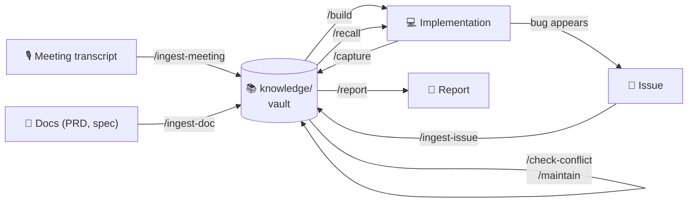
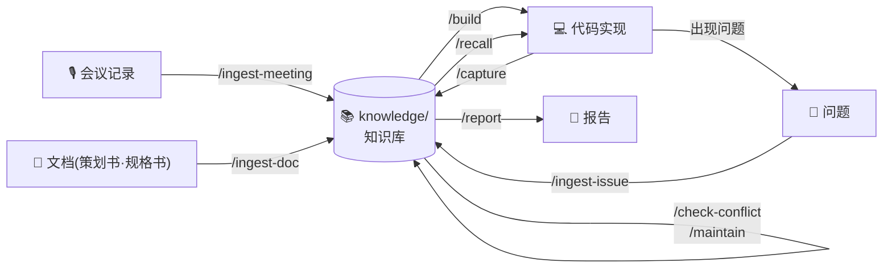
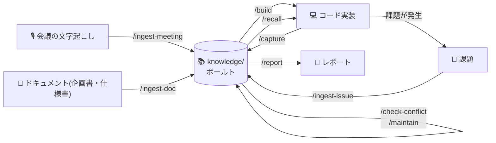
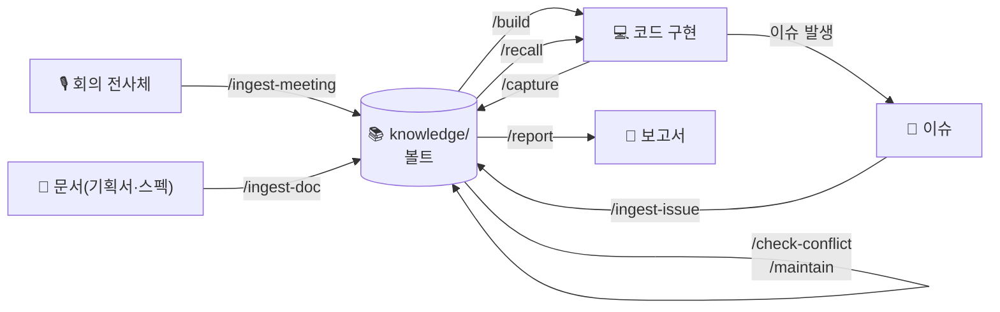

# 🧠 Project Second Brain Template


**🌐 Language / 언어 / 语言 / 言語** — 본문은 한국어입니다. 아래를 펼치면 다른 언어로 읽을 수 있습니다.

<details>
<summary><b>🇺🇸 Read in English</b></summary>

<br/>

> From meeting transcript → knowledge → code → conflict detection → reports → recurring-issue detection,
> all in one loop: a **per-project second brain** starter template.

**Zero dependencies.** No API keys, no embeddings, no Python scripts. It runs on pure Markdown plus rules and commands for AI coding agents.
Open the `knowledge/` folder in Obsidian and you can see how your knowledge connects in graph view.



---

## ⚡ Quick start

### Option A — Install into an existing project (npx, 30 seconds)

```bash
npx github:EM-H20/second-brain-template
```

Run it from the root of the project you want to install into. It **analyzes your project first**,
shows you exactly which files will be newly installed, updated, or left alone, and proceeds **only after a y/n confirmation**.

It is safe even if you already have a `CLAUDE.md` — the rules go into `SECOND-BRAIN.md` and only a
single `@SECOND-BRAIN.md` import line is appended. To pull template updates, just re-run the same
command — `_templates/` and each folder's `README.md` (the scaffolding) are refreshed to the latest
version, and any file whose content differed is backed up to `<file>.bak`, which keeps **only the
immediately previous version** (it is replaced on the next re-run). Your actual notes, `index.md`,
`log.md`, `clusters/_topics.md`, and the originals saved under `_sources/` are never touched.
In non-interactive environments such as CI, pass the `-y` flag to skip the confirmation.

### Option B — Start a new project from the template

1. Clone this repository, or copy it with the **"Use this template"** button, and use it as your new project root
2. Open Claude Code and run `/setup-vault` (once)

### Common next steps

1. **Connect Obsidian** (see the Obsidian section below) — open the `knowledge/` folder as a vault
2. Run `/ingest-meeting` on your first meeting transcript → the vault starts growing

---

## 📖 Usage — everyday scenarios

A second brain earns its value not when you **put things in**, but when you **pull things out**.
These seven scenes are the whole loop.

### 1. After a meeting — put the transcript into the vault

```
/ingest-meeting 2026-07-21-kickoff.md
```

Or in plain language: *"Put this meeting transcript into the vault"* (+ paste the text)

What happens automatically:
- A structured meeting note is created in `meetings/` (summary, agenda, discussion, action items)
- **A separate note for every decision** made in the meeting (`decisions/DEC-NNNN`)
- If a new decision **conflicts with a past active decision, it is detected immediately** and you are asked — nothing is ever silently overwritten
- The relevant topic clusters (`clusters/`) are updated

### 2. When implementing a feature — the vault supplies the context

```
/build build me the login screen
```

Before writing any code it first assembles a **context brief** from the vault:
relevant active decisions (citing DEC ids), recent meeting context, and similar past issues.
The AI tells you things like "last month you decided to use social login only" before you start.

### 3. When you want to change direction — conflict check

```
/check-conflict what if we add email login too?
```

If it conflicts with a past decision you get choices: **keep the old one / supersede it / keep both conditionally**.
Even when superseded, the old decision is preserved through a supersede chain — history never disappears.

### 4. When you fix a bug — keep it as knowledge

```
/ingest-issue troubleshooting-result.md   # turn an issue / completion report into knowledge
/find-similar-issue                       # "haven't we hit this before?"
```

Symptom keywords are stored in the frontmatter, so when the same problem recurs you are
**shown the past root cause and its fix first**. It also runs automatically while debugging.

### 5. When reporting — generate documents grounded in the vault

```
/report weekly-report-format.md
```

Every sentence traces back to a meeting, decision, or issue note (with id citations).
Anything not in the vault is reported as missing rather than invented.

### 6. When you receive a document — PRDs, specs, and articles become knowledge too

```
/ingest-doc payment-module-prd.md
```

Documents are weighted by authority (official / internal / external) and topical relevance
(core `topics` vs. reference `topics_ref`). Decisions inside official and internal documents are
extracted into DEC notes and must pass conflict detection, while external articles contribute
discussion points only — outside material never contaminates your decisions.

### 7. As you work — the system learns *how* you work

```
/capture always squash-merge feature branches   # save a work-rule as a lesson
/recall deployment                               # pulls relevant lessons into the brief
/maintain                                        # re-cluster + harvest lessons from the session
```

Cross-cutting rules — preferences, conventions, hard-won heuristics — that belong to no single
meeting or decision are saved as **lesson notes** (`lessons/LSN-NNNN`). A lesson carries a
`trigger` (when to surface it), so the next time you touch a matching topic, `/recall` shows the
rule **before** you act — the same way past issues resurface by symptom. Lessons are proposed at
natural moments (when you correct the AI, resolve a conflict, or close an issue) and saved only
with your approval — never silently. No session-end nagging, no fine-tuning; the model stays the
same, but the material it pulls keeps getting better.

> 💡 Commands are just a convenience — **natural language is the interface.** The workflows are
> defined in `SECOND-BRAIN.md` by intent, so they work identically in a CLI that has no commands.

---

## 🟣 Connecting Obsidian

The vault is pure Markdown and works without Obsidian, but connecting it lets you
**see the web of knowledge** in graph view.

### Connect (1 minute)

1. Install Obsidian from [obsidian.md](https://obsidian.md) (free)
2. Launch it → **"Open folder as vault"**
3. **Select the `knowledge/` folder** inside your project — pick `knowledge/`, not the project root,
   so code and config files don't pollute the graph
4. Open graph view: `Cmd/Ctrl + G`

Per-folder color groups (meetings = blue, decisions = green, issues = red, docs = purple, clusters = yellow)
are preconfigured in `knowledge/.obsidian/graph.json` — they apply the moment you open the vault.

### Worth looking at

- **Graph view**: meetings ↔ decisions ↔ issues linked by wiki links (`[[...]]`).
  Topic clusters naturally group together
- **Backlinks panel**: open a decision note and you see, in reverse, which meetings and issues reference it
- **`knowledge/index.md`**: the entrance to the vault. Start here and you won't get lost

### Optional plugins

| Plugin | Purpose |
|---|---|
| **Obsidian Git** | Automatic commit/push backup of the vault (configurable interval) |
| **Dataview** | Frontmatter-based queries — dynamic tables like "all open issues" or "active decisions" |

> ⚠️ `.obsidian/workspace*` is already in `.gitignore`, so your personal editor state
> doesn't pollute the repository.

---

## 🗂 Command reference

| Command | Role |
|---|---|
| `/setup-vault` | One-time initialization right after cloning |
| `/ingest-meeting` | Transcript → meeting note + decision extraction + cluster update + conflict check |
| `/ingest-doc` | Turn PRDs, specs, and articles into knowledge — authority/relevance weighting + decision extraction |
| `/cluster` | Re-cluster the whole vault, merge duplicate topics |
| `/build` | Vault context brief → hand off to the harness (Superpowers/ECC) workflow for implementation |
| `/check-conflict` | Check a new opinion against past active decisions |
| `/report` | Generate a vault-grounded report in your own format |
| `/ingest-issue` | Turn issues / completion reports into knowledge |
| `/find-similar-issue` | Search past issues similar to the current problem |
| `/capture` | Judge the input and save it to meetings/docs/issues/lessons as appropriate |
| `/recall` | Gather topic-related decisions, issues, docs, and lessons into a context brief |
| `/maintain` | Re-cluster + merge duplicate topics + harvest lessons from the session |

## 🏗 Structure

```
knowledge/
├── meetings/     Meeting notes (YYYY-MM-DD-slug.md)
├── decisions/    Decision records (DEC-NNNN) — the baseline for conflict detection
├── issues/       Issues + completion reports (ISS-NNNN) — the raw material for recurrence detection
├── docs/         Document summary notes (DOC-NNNN) — authority/relevance weighting
├── lessons/      Lesson notes (LSN-NNNN) — accumulated and reused via capture/recall/maintain
├── reports/      Generated reports
├── clusters/     Topic indexes + _topics.md (controlled vocabulary)
├── _templates/   Note templates (including frontmatter schema)
└── _sources/     Verbatim preservation of originals (mirrors meetings/docs/issues)
SECOND-BRAIN.md   Workflow rules (W1–W8) — the heart of the system
CLAUDE.md         A single @SECOND-BRAIN.md import line (avoids clashing with existing projects)
.claude/commands/ 12 slash commands (9 original + capture/recall/maintain)
.codex/prompts/   The Codex version of the same commands
```

## 🤝 Relationship with harnesses

This template owns **"what to build and why"** (the context).
**"How to build it well"** (TDD, brainstorming, debugging) is owned by whatever harness
is installed in the project (Superpowers, ECC, etc.). `/build` assembles the context brief and then
passes the baton to the harness workflow. It works fine with no harness at all.

## 🔁 Cross-CLI support (Claude Code + Codex)

There is a single source of rules, `SECOND-BRAIN.md`, and `AGENTS.md` is a pointer that guides
other CLIs such as Codex to the same rules. Commands ship in two flavors:

- Claude Code: `.claude/commands/` (auto-detected)
- Codex: `.codex/prompts/` (depending on the version, may need copying to `~/.codex/prompts/`)

It also works through natural language in CLIs that have no commands — because the workflows are
defined in `SECOND-BRAIN.md` by intent. ("Put this transcript in the vault" = run all of W1.)

## ✍️ Filename rules (CJK caveat)

Filenames must be ASCII kebab-case (`2026-07-15-auth-review.md`). Why: macOS (APFS) normalizes
CJK characters to NFD (decomposed), while git and Linux use NFC (precomposed), so wiki links can
break when syncing across machines. Put CJK titles in the frontmatter or the body H1 — note
content in your own language, filenames in ASCII.

## ☁️ Tip when publishing to GitHub

After uploading the repo, go to Settings → General → check **Template repository**.
From then on every new project can be created with the "Use this template" button, so you never
need to clone and then cut the history.

## ⚙️ How it works (without any scripts)

Every note's frontmatter follows a strict schema (`type`, `topics`, `symptoms`, `status`,
supersede chains). Instead of reading whole files, Claude greps the frontmatter to narrow down
candidates and then opens only the notes it needs. Clustering stays consistent because of
`clusters/_topics.md` (a controlled vocabulary). Same philosophy as the Karpathy LLM Wiki pattern:
**well-structured Markdown can be handled directly by an LLM, no embeddings required.**

Ingested **original text is preserved verbatim in `_sources/`**, and each note's `source:` field
points at that path. AI summaries are lossy, so keeping the original inside the vault gives you a
ground truth you can check summary fidelity against at any time. `_sources/` is excluded from
search and the graph to keep the vault light.

</details>

<details>
<summary><b>🇨🇳 中文版</b></summary>

<br/>

> 从会议记录 → 知识化 → 编写代码 → 冲突检测 → 报告 → 问题复现检测，
> 一条闭环走完的**项目专属第二大脑**启动模板。

**零依赖。** 无需 API 密钥、嵌入向量或 Python 脚本。仅靠纯 Markdown 加上 AI 编码代理的规则与命令即可运行。
用 Obsidian 打开 `knowledge/` 文件夹，就能在图谱视图中直观地看到知识之间的连接。



---

## ⚡ 快速开始

### 方式 A — 安装到现有项目（npx，30 秒）

```bash
npx github:EM-H20/second-brain-template
```

在要安装的项目根目录下运行。它会**先分析当前项目**，
列出将被新建、更新或保留的文件清单，并在**确认 y/n 之后**才继续。

即使已有 `CLAUDE.md` 也是安全的 —— 规则会写入 `SECOND-BRAIN.md`，
只会追加一行 `@SECOND-BRAIN.md` 导入语句。想获取模板更新时，重新运行同一条命令即可：
`_templates/` 和各文件夹的 `README.md`（脚手架文件）会更新到最新版本，
内容有差异的文件会备份为 `<文件>.bak`，且**只保留紧邻的上一个版本**（下次重新运行时会被替换）。
你真正的笔记、`index.md`、`log.md`、`clusters/_topics.md` 以及 `_sources/` 中保存的原文，绝不会被改动。
在 CI 等非交互环境中，可用 `-y` 参数跳过确认。

### 方式 B — 以模板开启新项目

1. clone 本仓库，或用 **"Use this template"** 按钮复制，作为新项目根目录
2. 打开 Claude Code 并运行 `/setup-vault`（仅一次）

### 共同的后续步骤

1. **连接 Obsidian**（见下方 Obsidian 章节）—— 将 `knowledge/` 文件夹作为库打开
2. 对第一份会议记录运行 `/ingest-meeting` → 知识库开始生长

---

## 📖 用法 —— 日常场景

第二大脑的价值不在**存入**的时候，而在**取出**的时候产生。
以下七个场景就是完整闭环。

### 1. 会议结束后 —— 把记录存入知识库

```
/ingest-meeting 2026-07-21-kickoff.md
```

或者用自然语言：*"把这份会议记录存进知识库"*（+ 粘贴文本）

自动发生的事：
- 在 `meetings/` 中生成结构化会议笔记（摘要、议题、讨论、行动项）
- 会议中做出的**每个决策都生成独立笔记**（`decisions/DEC-NNNN`）
- 新决策若**与过去的有效决策冲突，会被立即检测**并询问你 —— 绝不会静默覆盖
- 更新相关的主题聚类（`clusters/`）

### 2. 实现功能时 —— 知识库提供上下文

```
/build 帮我做登录页面
```

在动手实现之前，先从知识库生成**上下文简报**：
相关的有效决策（引用 DEC id）、最近的会议脉络、类似的历史问题。
类似"上个月已经决定只用社交登录"这种事，AI 会先告诉你。

### 3. 想改变方向时 —— 冲突检查

```
/check-conflict 要不要也加上邮箱登录？
```

若与过去的决策冲突，会给出选项：**保留原有 / 用新的取代 / 有条件并存**。
即使被取代，旧决策也会通过 supersede 链保留下来 —— 历史绝不会消失。

### 4. 修复 bug 之后 —— 把它沉淀为知识

```
/ingest-issue 排查结果.md          # 将问题/完成报告知识化
/find-similar-issue                # "这问题以前是不是遇到过？"
```

症状关键词会存入 frontmatter，因此当同样的问题复现时，
你会**先看到过去的根因和解决方案**。调试过程中也会自动运行。

### 5. 汇报时 —— 基于知识库依据生成文档

```
/report 周报格式.md
```

每一句话都能追溯到会议、决策或问题笔记（附 id 引用）。
知识库中没有的内容不会被编造，而是明确说明"没有"。

### 6. 收到文档时 —— 策划书、规格书、文章也能变成知识

```
/ingest-doc 支付模块策划书.md
```

按权威性（official / internal / external）与主题关联度
（核心 `topics` / 参考 `topics_ref`）进行加权。官方与内部文档中的决策会被提取为 DEC 笔记
并须通过冲突检测，而外部文章只留下论点 —— 外部材料不会污染你的决策。

### 7. 工作时 —— 系统学会你的"工作方式"

```
/capture 功能分支一律 squash-merge   # 把工作规则存为教训
/recall 部署                         # 把相关教训拉进简报
/maintain                            # 重新聚类 + 收获本次会话的教训
```

不属于任何会议或决策的横向规则 —— 偏好、约定、来之不易的经验法则 —— 会存为**教训笔记**（`lessons/LSN-NNNN`）。
教训带有 `trigger`（何时取出），因此下次处理相关主题时，`/recall` 会在你动手**之前**先展示该规则 ——
与历史问题按症状复现的方式相同。教训在自然时机（你纠正 AI、解决冲突、关闭问题时）被提议，
且只有经你批准才保存 —— 绝不会静默保存。没有会话结束时的打扰，也没有微调；模型本身不变，
但它取用的材料会越来越好。

> 💡 命令只是便利手段，**自然语言才是接口**。工作流在 `SECOND-BRAIN.md` 中
> 以意图为基准定义，因此在没有命令的 CLI 中同样有效。

---

## 🟣 连接 Obsidian

知识库是纯 Markdown，没有 Obsidian 也能运行，
但连接之后可以用**图谱视图**亲眼看到知识的连接网络。

### 连接（1 分钟）

1. 从 [obsidian.md](https://obsidian.md) 安装 Obsidian（免费）
2. 启动 → **"Open folder as vault"**（作为库打开文件夹）
3. **选择项目内的 `knowledge/` 文件夹** —— 要选 `knowledge/` 而不是项目根目录，
   这样代码和配置文件才不会混进图谱
4. 打开图谱视图：`Cmd/Ctrl + G`

按文件夹划分的颜色分组（会议=蓝、决策=绿、问题=红、文档=紫、聚类=黄）
已在 `knowledge/.obsidian/graph.json` 中预设 —— 打开知识库即刻生效。

### 值得一看的地方

- **图谱视图**：会议 ↔ 决策 ↔ 问题通过 wiki 链接（`[[...]]`）串联成的知识网。
  主题聚类会自然地聚拢显现
- **反向链接面板**：打开一条决策笔记，就能反向看到"引用了这条决策的会议/问题"
- **`knowledge/index.md`**：知识库的入口。从这里出发就不会迷路

### 可选插件

| 插件 | 用途 |
|---|---|
| **Obsidian Git** | 知识库自动 commit/push 备份（周期可配置） |
| **Dataview** | 基于 frontmatter 的查询 —— "所有未解决问题""有效决策列表"之类的动态表格 |

> ⚠️ `.obsidian/workspace*` 已登记在 `.gitignore` 中，
> 个人的编辑状态不会污染仓库。

---

## 🗂 命令参考

| 命令 | 作用 |
|---|---|
| `/setup-vault` | clone 之后的一次性初始化 |
| `/ingest-meeting` | 记录 → 会议笔记 + 决策拆分 + 聚类更新 + 冲突检查 |
| `/ingest-doc` | 将策划书、规格书、文章等文档知识化 —— 权威性/关联度加权 + 决策提取 |
| `/cluster` | 对整个知识库重新聚类，合并重复主题 |
| `/build` | 知识库上下文简报 → 交由 harness（Superpowers/ECC）工作流实现 |
| `/check-conflict` | 检查新观点与过去有效决策的冲突 |
| `/report` | 按你的格式生成有知识库依据的报告 |
| `/ingest-issue` | 将问题/完成报告知识化 |
| `/find-similar-issue` | 检索与当前问题相似的历史问题 |
| `/capture` | 判断输入内容，存入会议/文档/问题/教训中最合适的位置 |
| `/recall` | 汇总主题相关的决策·问题·文档·教训，生成上下文简报 |
| `/maintain` | 重新聚类 + 合并重复主题 + 收获本次会话的教训 |

## 🏗 结构

```
knowledge/
├── meetings/     会议笔记 (YYYY-MM-DD-slug.md)
├── decisions/    决策记录 (DEC-NNNN) —— 冲突检测的基准点
├── issues/       问题 + 完成报告 (ISS-NNNN) —— 复现检测的素材
├── docs/         文档摘要笔记 (DOC-NNNN) —— 权威性/关联度加权
├── lessons/      教训笔记 (LSN-NNNN) —— 通过 capture/recall/maintain 积累并复用
├── reports/      生成的报告
├── clusters/     主题索引 + _topics.md (受控词汇表)
├── _templates/   笔记模板 (含 frontmatter 规格)
└── _sources/     原文逐字保存 (镜像 meetings/docs/issues)
SECOND-BRAIN.md   工作流规则 (W1~W8) —— 系统的心脏
CLAUDE.md         仅一行 @SECOND-BRAIN.md 导入 (避免与既有项目冲突)
.claude/commands/ 12 个斜杠命令 (原有 9 个 + capture/recall/maintain)
.codex/prompts/   同一批命令的 Codex 版本
```

## 🤝 与 harness 的关系

本模板负责**"做什么、为什么做"（上下文）**。
**"怎样做好"（TDD、头脑风暴、调试）** 由项目中安装的 harness（Superpowers、ECC 等）负责。
`/build` 生成上下文简报后，把接力棒交给 harness 工作流。没有 harness 也能运行。

## 🔁 跨 CLI 支持（Claude Code + Codex）

规则的唯一来源是 `SECOND-BRAIN.md`，而 `AGENTS.md` 是引导 Codex 等其他 CLI
遵循同一规则的指针。命令提供两套：

- Claude Code：`.claude/commands/`（自动识别）
- Codex：`.codex/prompts/`（视版本可能需复制到 `~/.codex/prompts/`）

在没有命令的 CLI 中也能用自然语言驱动 —— 因为工作流在 `SECOND-BRAIN.md` 中
以意图为基准定义。（"把这份记录存进知识库" = 执行完整的 W1）

## ✍️ 文件名规则（CJK 注意事项）

文件名必须使用 ASCII kebab-case（`2026-07-15-auth-review.md`）。原因：
macOS(APFS) 将 CJK 字符规范化为 NFD（分解形），而 git/Linux 使用 NFC（预组合形），
因此在设备间同步时 wiki 链接可能断裂。CJK 标题请写在 frontmatter 或正文 H1 中 ——
笔记内容用母语，文件名用 ASCII。

## ☁️ 上传到 GitHub 时的小技巧

上传仓库后，进入 Settings → General → 勾选 **Template repository**。
此后每个新项目都能用 "Use this template" 按钮创建干净副本，
无需 clone 之后再切断历史记录。

## ⚙️ 工作原理（没有脚本是怎么做到的？）

所有笔记的 frontmatter 都遵循严格规格（`type`、`topics`、`symptoms`、`status`、
supersede 链）。Claude 不是读取整个文件，而是 grep frontmatter 缩小候选范围，
再只打开需要的笔记。聚类的一致性由 `clusters/_topics.md`（受控词汇表）来保证。
与 Karpathy LLM Wiki 模式相同的理念：
**结构良好的 Markdown，无需嵌入向量，LLM 也能直接处理。**

导入的**原始文本会原封不动（verbatim）保存在 `_sources/`** 中，
每条笔记的 `source:` 字段指向该路径。AI 摘要是有损的，原文留在知识库内，
就成了随时可以核对摘要保真度的 ground truth。`_sources/` 被排除在检索与图谱之外，
以保持知识库的轻量。

</details>

<details>
<summary><b>🇯🇵 日本語版</b></summary>

<br/>

> 会議の文字起こし → 知識化 → コード実装 → 衝突検知 → レポート → 課題の再発検知まで
> 一つのループで回る、**プロジェクトごとのセカンドブレイン**スターターテンプレート。

**依存ゼロ。** API キー、埋め込み、Python スクリプトは不要。純粋な Markdown と AI コーディングエージェント用のルール／コマンドだけで動作します。
Obsidian で `knowledge/` フォルダを開けば、グラフビューで知識のつながりを視覚的に確認できます。



---

## ⚡ クイックスタート

### 方法 A — 既存プロジェクトにインストール（npx、30 秒）

```bash
npx github:EM-H20/second-brain-template
```

インストール先プロジェクトのルートで実行すると、**まず現在のプロジェクトを解析**し、
新規インストール／更新／維持されるファイルの一覧を表示したうえで、**y/n の確認後**に進みます。

既存の `CLAUDE.md` があっても安全です —— ルールは `SECOND-BRAIN.md` に入り、
`@SECOND-BRAIN.md` という import 行が 1 行追加されるだけです。テンプレートの更新を取り込むには
同じコマンドを再実行するだけ —— `_templates/` と各フォルダの `README.md`（スキャフォールディング）は
最新版に更新され、内容が異なっていたファイルは `<ファイル>.bak` としてバックアップされます。
この `.bak` は**直前のバージョン 1 つだけ**を保持します（次回の再実行時に置き換わります）。
実際のノート、`index.md`、`log.md`、`clusters/_topics.md`、`_sources/` に保存された原文は決して触れられません。
CI などの非対話環境では `-y` フラグで確認をスキップできます。

### 方法 B — テンプレートから新規プロジェクトを開始

1. このリポジトリを clone するか、**"Use this template"** ボタンでコピーして新プロジェクトのルートとして使う
2. Claude Code を開いて `/setup-vault` を実行（1 回のみ）

### 共通の次のステップ

1. **Obsidian と連携**（下記 Obsidian セクション参照）—— `knowledge/` フォルダをボールトとして開く
2. 最初の会議の文字起こしで `/ingest-meeting` を実行 → ボールトが育ち始めます

---

## 📖 使い方 — 日常のシナリオ

セカンドブレインは**入れるとき**ではなく、**取り出すとき**に価値が生まれます。
以下の 7 つの場面が全体のループです。

### 1. 会議が終わったら — 文字起こしをボールトへ

```
/ingest-meeting 2026-07-21-kickoff.md
```

または自然言語で：*「この会議の文字起こしをボールトに入れて」*（+ テキストを貼り付け）

自動的に起こること：
- `meetings/` に構造化された議事録を生成（要約・議題・議論・アクションアイテム）
- 会議で下された**決定ごとに個別ノート**を生成（`decisions/DEC-NNNN`）
- 新しい決定が**過去の有効な決定と衝突すれば即座に検知**して確認を求めます —— 黙って上書きすることはありません
- 関連するトピッククラスタ（`clusters/`）を更新

### 2. 機能を実装するとき — ボールトがコンテキストを供給する

```
/build ログイン画面を作って
```

実装の前に、まずボールトから**コンテキストブリーフ**を作成します：
関連する有効な決定（DEC id を引用）、直近の会議の文脈、類似の過去課題。
「先月ソーシャルログインだけを使うと決めましたよ」といったことを AI が先に教えてくれます。

### 3. 方針を変えたいとき — 衝突チェック

```
/check-conflict メールログインも追加するのはどう？
```

過去の決定と衝突する場合、選択肢が提示されます：**既存を維持 / 新しいもので置き換え / 条件付きで併存**。
置き換えても古い決定は supersede チェーンで保存されます —— 履歴が消えることはありません。

### 4. バグを直したら — 知識として残す

```
/ingest-issue トラブルシューティング結果.md   # 課題／完了レポートを知識化
/find-similar-issue                          # 「これ前にも遭遇した問題では？」
```

症状キーワードが frontmatter に保存されるため、同じ問題が再発したときは
**過去の原因と解決策が先に提示されます**。デバッグ中は自動でも動作します。

### 5. 報告するとき — ボールトを根拠にドキュメントを生成

```
/report 週報フォーマット.md
```

すべての文が会議・決定・課題ノートに根拠を持ちます（id を引用）。
ボールトにない内容は捏造せず、「ない」と明言します。

### 6. ドキュメントを受け取ったら — 企画書・仕様書・記事も知識に

```
/ingest-doc 決済モジュール企画書.md
```

権威性（official / internal / external）とトピック関連度
（中核 `topics` / 参考 `topics_ref`）で重み付けします。公式・社内ドキュメント内の決定は
DEC ノートとして抽出され衝突検知を通過する必要があり、外部記事は論点のみを残します ——
外部資料が決定を汚染することはありません。

### 7. 作業しながら — システムが「仕事の進め方」を学ぶ

```
/capture 機能ブランチは常に squash-merge   # 仕事のルールを教訓として保存
/recall デプロイ                          # 関連する教訓をブリーフに引き込む
/maintain                                # クラスタ再構成 + セッションの教訓を収穫
```

会議にも決定にも紐づかない横断的なルール —— 好み、規約、苦労して得た経験則 —— は
**教訓ノート**（`lessons/LSN-NNNN`）として残ります。教訓は `trigger`（いつ取り出すか）を
持つため、次に関連トピックを扱うとき、`/recall` が行動する**前に**そのルールを提示します ——
過去の課題が症状で再浮上するのと同じ仕組みです。教訓は自然なタイミング（AI を修正するとき、
衝突を解決するとき、課題を閉じるとき）に提案され、あなたの承認によってのみ保存されます ——
黙って保存されることはありません。セッション終了時の催促もなく、ファインチューニングもしません。
モデル自体は変わりませんが、引き出す材料はどんどん良くなります。

> 💡 コマンドは利便性のためのもので、**自然言語こそがインターフェース**です。ワークフローが
> `SECOND-BRAIN.md` に意図ベースで定義されているため、コマンドのない CLI でも同じように動作します。

---

## 🟣 Obsidian と連携する

ボールトは純粋な Markdown なので Obsidian なしでも動作しますが、
連携すると**グラフビュー**で知識のネットワークを目で見ることができます。

### 連携（1 分）

1. [obsidian.md](https://obsidian.md) から Obsidian をインストール（無料）
2. 起動 → **「フォルダをボールトとして開く」**（Open folder as vault）
3. プロジェクト内の **`knowledge/` フォルダを選択** —— プロジェクトルートではなく `knowledge/` を選ぶことで、
   コードや設定ファイルがグラフに混ざりません
4. グラフビューを開く：`Cmd/Ctrl + G`

フォルダごとの色グループ（会議=青、決定=緑、課題=赤、ドキュメント=紫、クラスタ=黄）は
`knowledge/.obsidian/graph.json` にあらかじめ設定済みです —— ボールトを開けばすぐ適用されます。

### 見ておくとよいもの

- **グラフビュー**：会議 ↔ 決定 ↔ 課題が wiki リンク（`[[...]]`）でつながった知識網。
  トピッククラスタが自然にまとまって見えます
- **バックリンクパネル**：決定ノートを開くと「この決定を参照している会議／課題」が逆方向に表示されます
- **`knowledge/index.md`**：ボールトの入口。ここから始めれば迷いません

### オプションプラグイン

| プラグイン | 用途 |
|---|---|
| **Obsidian Git** | ボールトの自動 commit/push バックアップ（周期設定可） |
| **Dataview** | frontmatter ベースのクエリ ——「未解決の課題すべて」「有効な決定一覧」のような動的テーブル |

> ⚠️ `.obsidian/workspace*` はすでに `.gitignore` に登録済みなので、
> 個人の編集状態がリポジトリを汚染することはありません。

---

## 🗂 コマンドリファレンス

| コマンド | 役割 |
|---|---|
| `/setup-vault` | clone 直後の 1 回だけの初期化 |
| `/ingest-meeting` | 文字起こし → 議事録 + 決定の分離 + クラスタ更新 + 衝突チェック |
| `/ingest-doc` | 企画書・仕様書・記事などのドキュメントを知識化 —— 権威性/関連度の重み付け + 決定抽出 |
| `/cluster` | ボールト全体を再クラスタリング、重複トピックを統合 |
| `/build` | ボールトのコンテキストブリーフ → ハーネス（Superpowers/ECC）ワークフローで実装 |
| `/check-conflict` | 新しい意見 vs 過去の有効な決定の衝突チェック |
| `/report` | ユーザーのフォーマット通りにボールトを根拠としたレポートを生成 |
| `/ingest-issue` | 課題／完了レポートを知識化 |
| `/find-similar-issue` | 現在の問題と類似する過去の課題を検索 |
| `/capture` | 入力内容を判断し、会議/ドキュメント/課題/教訓のうち適切な場所に保存 |
| `/recall` | トピック関連の決定・課題・ドキュメント・教訓を集めてコンテキストブリーフを作成 |
| `/maintain` | クラスタ再構成 + 重複トピック統合 + セッションの教訓を収穫 |

## 🏗 構造

```
knowledge/
├── meetings/     議事録 (YYYY-MM-DD-slug.md)
├── decisions/    決定記録 (DEC-NNNN) — 衝突検知の基準点
├── issues/       課題 + 完了レポート (ISS-NNNN) — 再発検知の材料
├── docs/         ドキュメント要約ノート (DOC-NNNN) — 権威性/関連度の重み付け
├── lessons/      教訓ノート (LSN-NNNN) — capture/recall/maintain で蓄積・再利用される経験則
├── reports/      生成されたレポート
├── clusters/     トピック別インデックス + _topics.md (統制語彙)
├── _templates/   ノートのテンプレート (frontmatter 規格を含む)
└── _sources/     原文をそのまま (verbatim) 保存 (meetings/docs/issues のミラー)
SECOND-BRAIN.md   ワークフロー規則 (W1〜W8) — システムの心臓部
CLAUDE.md         @SECOND-BRAIN.md の import 1 行 (既存プロジェクトとの衝突を防ぐ)
.claude/commands/ スラッシュコマンド 12 個 (既存 9 個 + capture/recall/maintain)
.codex/prompts/   同じコマンドの Codex 版
```

## 🤝 ハーネスとの関係

このテンプレートは**「何を、なぜ作るのか」（コンテキスト）**を担います。
**「どう上手く作るか」（TDD、ブレインストーミング、デバッグ）**は、プロジェクトに導入された
ハーネス（Superpowers、ECC など）が担います。`/build` はコンテキストブリーフを作った後、
ハーネスのワークフローにバトンを渡します。ハーネスがなくても動作します。

## 🔁 クロス CLI 対応（Claude Code + Codex）

ルールの原本は `SECOND-BRAIN.md` ひとつであり、`AGENTS.md` は Codex など他の CLI を
同じルールへ導くポインタです。コマンドは 2 種類提供されます：

- Claude Code：`.claude/commands/`（自動認識）
- Codex：`.codex/prompts/`（バージョンによっては `~/.codex/prompts/` へのコピーが必要）

コマンドのない CLI でも自然言語で動作します —— ワークフローが `SECOND-BRAIN.md` に
意図ベースで定義されているためです。（「この文字起こしをボールトに入れて」= W1 全体を実行）

## ✍️ ファイル名の規則（CJK の注意点）

ファイル名は必ず ASCII kebab-case（`2026-07-15-auth-review.md`）にします。理由：
macOS(APFS) は CJK 文字を NFD（分解形）に、git/Linux は NFC（合成形）に正規化するため、
端末間で同期する際に wiki リンクが壊れる可能性があります。CJK のタイトルは frontmatter か
本文の H1 に書きます —— ノートの内容は母語で、ファイル名だけ ASCII で。

## ☁️ GitHub に公開するときのヒント

リポジトリをアップロードした後、Settings → General → **Template repository** にチェック。
以降は新しいプロジェクトごとに "Use this template" ボタンでクリーンなコピーを作れるので、
clone した後に履歴を切る作業が不要になります。

## ⚙️ 動作原理（スクリプトなしでどうやって？）

すべてのノートの frontmatter が厳格な規格（`type`、`topics`、`symptoms`、`status`、
supersede チェーン）に従います。Claude はファイル全体を読む代わりに frontmatter を
grep して候補を絞り込み、必要なノートだけを開きます。クラスタリングの一貫性は
`clusters/_topics.md`（統制語彙）が担保します。Karpathy の LLM Wiki パターンと
同じ哲学です：**よく構造化された Markdown は、埋め込みなしでも LLM が直接扱える。**

取り込んだ**原文テキストは `_sources/` にそのまま（verbatim）保存**され、各ノートの
`source:` フィールドがそのパスを指します。AI の要約は損失を伴うため、原文がボールト内にあれば
要約の忠実度をいつでも照合できる ground truth になります。`_sources/` は検索・グラフから
除外され、ボールトを軽量に保ちます。

</details>

---

> 회의 전사체 → 지식화 → 코드 작성 → 충돌 감지 → 보고서 → 이슈 재발 탐지까지
> 하나로 도는, **프로젝트별 세컨드 브레인** 스타터 템플릿.

**의존성 제로.** API 키, 임베딩, 파이썬 스크립트 없음. 순수 Markdown + AI 코딩 에이전트 규칙/커맨드만으로 동작한다.
Obsidian으로 `knowledge/` 폴더를 열면 그래프 뷰로 지식 연결을 시각적으로 볼 수 있다.



---

## ⚡ 빠른 시작

### 방법 A — 기존 프로젝트에 설치 (npx, 30초)

```bash
npx github:EM-H20/second-brain-template
```

설치할 프로젝트 루트에서 실행하면 **현재 프로젝트를 먼저 분석**해서
신규 설치/갱신/유지될 파일 내역을 보여주고, **y/n 확인 후** 진행한다.

기존 `CLAUDE.md`가 있어도 안전하다 — 규칙은 `SECOND-BRAIN.md`로 들어가고
`@SECOND-BRAIN.md` import 한 줄만 추가된다. 템플릿 업데이트를 받으려면
같은 명령을 재실행하면 된다 — `_templates/`와 각 폴더의 `README.md`(스캐폴딩)는
최신본으로 갱신되고, 내용이 달랐던 파일은 `<파일>.bak`으로 직전 버전 1개만
백업된다(다음 재실행 시 교체). 실제 노트·`index.md`·`log.md`·
`clusters/_topics.md`·`_sources/` 저장 원본은 절대 건드리지 않는다.
CI 등 비대화형 환경에서는 `-y` 플래그로 확인을 건너뛴다.

### 방법 B — 템플릿으로 새 프로젝트 시작

1. 이 저장소를 clone 하거나 **"Use this template"** 버튼으로 복사해 새 프로젝트 루트로 사용
2. Claude Code를 열고 `/setup-vault` 실행 (1회)

### 공통 다음 단계

1. [Obsidian 연결](#-obsidian-연결하기) — `knowledge/` 폴더를 보관함으로 열기
2. 첫 회의 전사체로 `/ingest-meeting` 실행 → 볼트가 자라기 시작한다

---

## 📖 사용법 — 일상 시나리오

세컨드 브레인은 **넣을 때**가 아니라 **꺼낼 때** 가치가 생긴다.
아래 일곱 장면이 전체 루프다.

### 1. 회의가 끝나면 — 전사체를 볼트에 넣는다

```
/ingest-meeting 2026-07-21-kickoff.md
```

또는 자연어로: *"이 회의 전사체 볼트에 넣어줘"* (+ 텍스트 붙여넣기)

자동으로 일어나는 일:
- `meetings/`에 구조화된 회의노트 생성 (요약·안건·논의·액션아이템)
- 회의 중 내려진 **결정마다 별도 노트** 생성 (`decisions/DEC-NNNN`)
- 새 결정이 **과거 활성 결정과 충돌하면 즉시 감지**하고 물어본다 — 조용히 덮어쓰는 일은 없다
- 관련 주제 클러스터(`clusters/`) 갱신

### 2. 기능을 구현할 때 — 볼트가 컨텍스트를 공급한다

```
/build 로그인 화면 만들어줘
```

구현 전에 볼트에서 **컨텍스트 브리프**를 먼저 만든다:
관련 활성 결정(DEC id 인용), 최근 회의 맥락, 비슷한 과거 이슈.
"지난달에 소셜 로그인만 쓰기로 결정했는데요" 같은 걸 AI가 먼저 알려준다.

### 3. 방향을 바꾸고 싶을 때 — 충돌 검사

```
/check-conflict 이메일 로그인도 추가하면 어때?
```

과거 결정과 충돌하면 선택지를 준다: **기존 유지 / 신규로 대체 / 조건부 유지**.
대체해도 옛 결정은 supersede 체인으로 보존된다 — 히스토리는 절대 사라지지 않는다.

### 4. 버그를 잡았을 때 — 지식으로 남긴다

```
/ingest-issue 트러블슈팅_결과.md     # 이슈/완료 리포트를 지식화
/find-similar-issue                  # "이거 예전에 겪은 문제 아닌가?" 검색
```

증상 키워드가 frontmatter에 저장되어, 같은 문제가 재발하면
**과거 원인과 해결책을 먼저 제시**받는다. 디버깅 중에는 자동으로도 돈다.

### 5. 보고할 때 — 볼트 근거로 문서 생성

```
/report 주간보고 양식.md
```

모든 문장이 회의·결정·이슈 노트에 근거를 둔다 (id 인용).
볼트에 없는 내용은 지어내지 않고 "없다"고 말한다.

### 6. 문서를 받았을 때 — 기획서·스펙·아티클도 지식으로

```
/ingest-doc 결제모듈_기획서.md
```

권위(official/internal/external)와 주제 연관(핵심 `topics` / 참고 `topics_ref`)을
가중치로 매긴다. 공식·내부 문서 속 결정은 DEC 노트로 추출되어 충돌 감지를
통과해야 하고, 외부 아티클은 논점만 남긴다 — 외부 자료가 결정을 오염시키지 않는다.

### 7. 일하면서 — 시스템이 '일하는 방식'을 배운다

```
/capture 기능 브랜치는 항상 squash-merge   # 일하는 규칙을 교훈으로 저장
/recall 배포                              # 관련 교훈을 브리프에 끌어온다
/maintain                                # 클러스터 재구성 + 세션 교훈 수확
```

회의에도 결정에도 묶이지 않는 횡단 규칙 — 선호, 컨벤션, 어렵게 얻은 경험칙 — 은
**교훈 노트**(`lessons/LSN-NNNN`)로 남는다. 교훈에는 `trigger`(언제 꺼낼지)가 있어서,
다음에 관련 주제를 다룰 때 `/recall`이 행동하기 **전에** 그 규칙을 보여준다 —
과거 이슈가 증상으로 되살아나는 것과 같은 방식. 교훈은 자연스러운 순간(AI를 교정할 때,
충돌을 해결할 때, 이슈를 닫을 때) 제안되고 네 승인으로만 저장된다 — 조용히 저장되는 일은 없다.
세션 끝에 귀찮게 묻지도, 파인튜닝하지도 않는다 — 모델은 그대로지만 꺼내 쓰는 재료가 계속 좋아진다.

> 💡 커맨드는 편의일 뿐, **자연어가 곧 인터페이스**다. 워크플로우가
> `SECOND-BRAIN.md`에 의도 기준으로 정의되어 있어서 커맨드 없는 CLI에서도 똑같이 동작한다.

---

## 🟣 Obsidian 연결하기

볼트는 순수 Markdown이라 Obsidian 없이도 동작하지만,
연결하면 **그래프 뷰**로 지식의 연결망을 눈으로 볼 수 있다.

### 연결 (1분)

1. [obsidian.md](https://obsidian.md)에서 Obsidian 설치 (무료)
2. 실행 → **"보관함으로 폴더 열기"** (Open folder as vault)
3. 프로젝트 안의 **`knowledge/` 폴더 선택** — 프로젝트 루트가 아니라 `knowledge/`를 선택해야
   코드·설정 파일이 그래프에 섞이지 않는다
4. 그래프 뷰 열기: `Cmd/Ctrl + G`

폴더별 색 그룹(회의=파랑, 결정=초록, 이슈=빨강, 문서=보라, 클러스터=노랑)은
`knowledge/.obsidian/graph.json`으로 미리 설정되어 있다 — 볼트를 열면 바로 적용된다.

### 보면 좋은 것

- **그래프 뷰**: 회의 ↔ 결정 ↔ 이슈가 위키링크(`[[...]]`)로 연결된 지식망.
  주제 클러스터가 자연스럽게 뭉쳐 보인다
- **백링크 패널**: 결정 노트를 열면 "이 결정을 참조하는 회의/이슈"가 역방향으로 보인다
- **`knowledge/index.md`**: 볼트의 입구. 여기서 시작하면 길을 잃지 않는다

### 선택 플러그인

| 플러그인 | 용도 |
|---|---|
| **Obsidian Git** | 볼트 자동 commit/push 백업 (주기 설정 가능) |
| **Dataview** | frontmatter 기반 쿼리 — "열린 이슈 전부", "활성 결정 목록" 같은 동적 표 |

> ⚠️ `.obsidian/workspace*`는 `.gitignore`에 이미 등록되어 있어
> 개인 편집 상태가 저장소를 오염시키지 않는다.

---

## 🗂 커맨드 레퍼런스

| 커맨드 | 역할 |
|---|---|
| `/setup-vault` | clone 직후 1회 초기화 |
| `/ingest-meeting` | 전사체 → 회의노트 + 결정 분리 + 클러스터 갱신 + 충돌 검사 |
| `/ingest-doc` | 기획서·스펙·아티클 등 문서 지식화 — 권위·연관 가중치 + 결정 추출 |
| `/cluster` | 볼트 전체 재클러스터링, 중복 토픽 병합 |
| `/build` | 볼트 컨텍스트 브리프 → 하네스(Superpowers/ECC) 워크플로우로 구현 |
| `/check-conflict` | 새 의견 vs 과거 활성 결정 충돌 검사 |
| `/report` | 사용자 양식대로 볼트 근거 보고서 생성 |
| `/ingest-issue` | 이슈/완료 리포트 지식화 |
| `/find-similar-issue` | 현재 문제와 유사한 과거 이슈 검색 |
| `/capture` | 입력을 판단해 회의/문서/이슈/교훈 중 알맞은 곳에 저장 (기억해) |
| `/recall` | 주제 관련 결정·이슈·문서·교훈을 모아 컨텍스트 브리프 작성 (꺼내줘) |
| `/maintain` | 클러스터 재구성 + 중복 토픽 병합 + 세션 교훈 수확 (정리해) |

## 🏗 구조

```
knowledge/
├── meetings/     회의노트 (YYYY-MM-DD-slug.md)
├── decisions/    결정 기록 (DEC-NNNN) — 충돌 감지의 기준점
├── issues/       이슈 + 완료 리포트 (ISS-NNNN) — 재발 탐지의 재료
├── docs/         문서 요약 노트 (DOC-NNNN) — 권위·연관 가중치
├── lessons/      교훈 노트 (LSN-NNNN) — capture/recall/maintain로 쌓이고 재활용되는 경험칙
├── reports/      생성된 보고서
├── clusters/     주제별 인덱스 + _topics.md (통제 어휘)
├── _templates/   노트 양식 (frontmatter 규격 포함)
└── _sources/     원본 텍스트 verbatim 보존 (meetings/docs/issues 미러)
SECOND-BRAIN.md   워크플로우 규칙 (W1~W8) — 시스템의 심장
CLAUDE.md         @SECOND-BRAIN.md import 한 줄 (기존 프로젝트와 충돌 방지)
.claude/commands/ 슬래시 커맨드 12개 (기존 9개 + capture/recall/maintain)
.codex/prompts/   같은 커맨드의 Codex 버전
```

## 🤝 하네스와의 관계

이 템플릿은 **"무엇을 왜 만드는가"(컨텍스트)** 를 책임진다.
"어떻게 잘 만드는가"(TDD, 브레인스토밍, 디버깅)는 프로젝트에 설치된
하네스(Superpowers, ECC 등)가 책임진다. `/build`는 컨텍스트 브리프를 만든 뒤
하네스 워크플로우에 바통을 넘긴다. 하네스가 없어도 동작한다.

## 🔁 크로스-CLI 지원 (Claude Code + Codex)

규칙 원본은 `SECOND-BRAIN.md` 하나이며, `AGENTS.md`는 Codex 등 다른 CLI를
같은 규칙으로 안내하는 포인터다. 커맨드는 두 벌 제공:

- Claude Code: `.claude/commands/` (자동 인식)
- Codex: `.codex/prompts/` (버전에 따라 `~/.codex/prompts/` 로 복사 필요)

커맨드가 없는 CLI에서도 자연어로 동작한다 — 워크플로우가 `SECOND-BRAIN.md`에
의도 기준으로 정의되어 있기 때문. ("이 전사체 볼트에 넣어줘" = W1 전체 실행)

## ✍️ 파일명 규칙 (한글/CJK 주의)

파일명은 반드시 ASCII kebab-case (`2026-07-15-auth-review.md`). 이유:
macOS(APFS)는 한글을 NFD(자모 분리), git/Linux는 NFC(완성형)로 정규화해서
기기 간 동기화 시 위키링크가 깨질 수 있다. 한글 제목은 frontmatter나
본문 H1에 적는다 — 노트 내용은 한글, 파일명만 영문.

## ☁️ GitHub에 올릴 때 팁

리포 업로드 후 Settings → General → **Template repository** 체크.
이후 새 프로젝트마다 "Use this template" 버튼으로 깨끗한 사본을 만들 수
있어 clone 후 히스토리 끊는 작업이 필요 없다.

## ⚙️ 동작 원리 (스크립트 없이 어떻게?)

모든 노트의 frontmatter가 엄격한 규격(type, topics, symptoms, status,
supersedes 체인)을 따른다. Claude는 전체 파일을 읽는 대신 frontmatter를
grep해서 후보를 좁힌 뒤 필요한 노트만 연다. 클러스터링 일관성은
`clusters/_topics.md`(통제 어휘)가 잡아준다. Karpathy LLM Wiki 패턴과
같은 철학: **잘 구조화된 마크다운은 임베딩 없이도 LLM이 직접 다룰 수 있다.**

인제스트한 **원본 텍스트는 `_sources/`에 그대로(verbatim) 보존**되고 각 노트의
`source:` 필드가 그 경로를 가리킨다. AI 요약은 손실적이라, 원본이 볼트 안에 있으면
요약 충실도를 언제든 대조할 수 있는 ground truth가 된다. `_sources/`는 검색·그래프에서
제외되어 볼트를 가볍게 유지한다.
