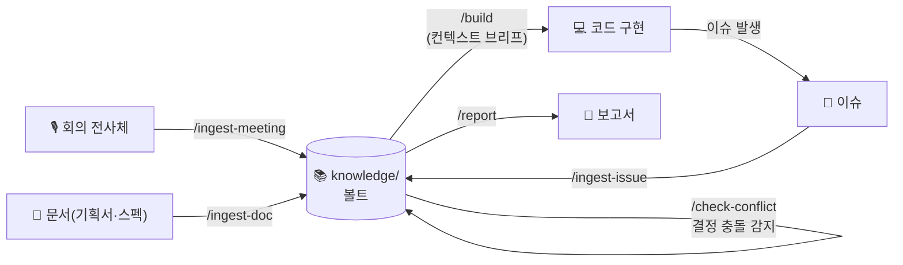

# 🧠 Project Second Brain Template


> 회의 전사체 → 지식화 → 코드 작성 → 충돌 감지 → 보고서 → 이슈 재발 탐지까지
> 하나로 도는, **프로젝트별 세컨드 브레인** 스타터 템플릿.

**의존성 제로.** API 키, 임베딩, 파이썬 스크립트 없음. 순수 Markdown + AI 코딩 에이전트 규칙/커맨드만으로 동작한다.
Obsidian으로 `knowledge/` 폴더를 열면 그래프 뷰로 지식 연결을 시각적으로 볼 수 있다.



---

## ⚡ 빠른 시작

### 방법 A — 기존 프로젝트에 설치 (npx, 30초)

```bash
npx github:EM-H20/second-brain-template
```

설치할 프로젝트 루트에서 실행하면 **현재 프로젝트를 먼저 분석**해서
신규 설치/갱신/유지될 파일 내역을 보여주고, **y/n 확인 후** 진행한다.

기존 `CLAUDE.md`가 있어도 안전하다 — 규칙은 `SECOND-BRAIN.md`로 들어가고
`@SECOND-BRAIN.md` import 한 줄만 추가된다. 템플릿 업데이트를 받으려면
같은 명령을 재실행하면 된다 — `_templates/`와 각 폴더의 `README.md`(스캐폴딩)는
최신본으로 갱신되고, 내용이 달랐던 파일은 `<파일>.bak`으로 직전 버전 1개만
백업된다(다음 재실행 시 교체). 실제 노트·`index.md`·`log.md`·
`clusters/_topics.md`·`_sources/` 저장 원본은 절대 건드리지 않는다.
CI 등 비대화형 환경에서는 `-y` 플래그로 확인을 건너뛴다.

### 방법 B — 템플릿으로 새 프로젝트 시작

1. 이 저장소를 clone 하거나 **"Use this template"** 버튼으로 복사해 새 프로젝트 루트로 사용
2. Claude Code를 열고 `/setup-vault` 실행 (1회)

### 공통 다음 단계

1. [Obsidian 연결](#-obsidian-연결하기) — `knowledge/` 폴더를 보관함으로 열기
2. 첫 회의 전사체로 `/ingest-meeting` 실행 → 볼트가 자라기 시작한다

---

## 📖 사용법 — 일상 시나리오

세컨드 브레인은 **넣을 때**가 아니라 **꺼낼 때** 가치가 생긴다.
아래 다섯 장면이 전체 루프다.

### 1. 회의가 끝나면 — 전사체를 볼트에 넣는다

```
/ingest-meeting 2026-07-21-kickoff.md
```

또는 자연어로: *"이 회의 전사체 볼트에 넣어줘"* (+ 텍스트 붙여넣기)

자동으로 일어나는 일:
- `meetings/`에 구조화된 회의노트 생성 (요약·안건·논의·액션아이템)
- 회의 중 내려진 **결정마다 별도 노트** 생성 (`decisions/DEC-NNNN`)
- 새 결정이 **과거 활성 결정과 충돌하면 즉시 감지**하고 물어본다 — 조용히 덮어쓰는 일은 없다
- 관련 주제 클러스터(`clusters/`) 갱신

### 2. 기능을 구현할 때 — 볼트가 컨텍스트를 공급한다

```
/build 로그인 화면 만들어줘
```

구현 전에 볼트에서 **컨텍스트 브리프**를 먼저 만든다:
관련 활성 결정(DEC id 인용), 최근 회의 맥락, 비슷한 과거 이슈.
"지난달에 소셜 로그인만 쓰기로 결정했는데요" 같은 걸 AI가 먼저 알려준다.

### 3. 방향을 바꾸고 싶을 때 — 충돌 검사

```
/check-conflict 이메일 로그인도 추가하면 어때?
```

과거 결정과 충돌하면 선택지를 준다: **기존 유지 / 신규로 대체 / 조건부 유지**.
대체해도 옛 결정은 supersede 체인으로 보존된다 — 히스토리는 절대 사라지지 않는다.

### 4. 버그를 잡았을 때 — 지식으로 남긴다

```
/ingest-issue 트러블슈팅_결과.md     # 이슈/완료 리포트를 지식화
/find-similar-issue                  # "이거 예전에 겪은 문제 아닌가?" 검색
```

증상 키워드가 frontmatter에 저장되어, 같은 문제가 재발하면
**과거 원인과 해결책을 먼저 제시**받는다. 디버깅 중에는 자동으로도 돈다.

### 5. 보고할 때 — 볼트 근거로 문서 생성

```
/report 주간보고 양식.md
```

모든 문장이 회의·결정·이슈 노트에 근거를 둔다 (id 인용).
볼트에 없는 내용은 지어내지 않고 "없다"고 말한다.

### 6. 문서를 받았을 때 — 기획서·스펙·아티클도 지식으로

```
/ingest-doc 결제모듈_기획서.md
```

권위(official/internal/external)와 주제 연관(핵심 `topics` / 참고 `topics_ref`)을
가중치로 매긴다. 공식·내부 문서 속 결정은 DEC 노트로 추출되어 충돌 감지를
통과해야 하고, 외부 아티클은 논점만 남긴다 — 외부 자료가 결정을 오염시키지 않는다.

> 💡 커맨드는 편의일 뿐, **자연어가 곧 인터페이스**다. 워크플로우가
> `SECOND-BRAIN.md`에 의도 기준으로 정의되어 있어서 커맨드 없는 CLI에서도 똑같이 동작한다.

---

## 🟣 Obsidian 연결하기

볼트는 순수 Markdown이라 Obsidian 없이도 동작하지만,
연결하면 **그래프 뷰**로 지식의 연결망을 눈으로 볼 수 있다.

### 연결 (1분)

1. [obsidian.md](https://obsidian.md)에서 Obsidian 설치 (무료)
2. 실행 → **"보관함으로 폴더 열기"** (Open folder as vault)
3. 프로젝트 안의 **`knowledge/` 폴더 선택** — 프로젝트 루트가 아니라 `knowledge/`를 선택해야
   코드·설정 파일이 그래프에 섞이지 않는다
4. 그래프 뷰 열기: `Cmd/Ctrl + G`

폴더별 색 그룹(회의=파랑, 결정=초록, 이슈=빨강, 문서=보라, 클러스터=노랑)은
`knowledge/.obsidian/graph.json`으로 미리 설정되어 있다 — 볼트를 열면 바로 적용된다.

### 보면 좋은 것

- **그래프 뷰**: 회의 ↔ 결정 ↔ 이슈가 위키링크(`[[...]]`)로 연결된 지식망.
  주제 클러스터가 자연스럽게 뭉쳐 보인다
- **백링크 패널**: 결정 노트를 열면 "이 결정을 참조하는 회의/이슈"가 역방향으로 보인다
- **`knowledge/index.md`**: 볼트의 입구. 여기서 시작하면 길을 잃지 않는다

### 선택 플러그인

| 플러그인 | 용도 |
|---|---|
| **Obsidian Git** | 볼트 자동 commit/push 백업 (주기 설정 가능) |
| **Dataview** | frontmatter 기반 쿼리 — "열린 이슈 전부", "활성 결정 목록" 같은 동적 표 |

> ⚠️ `.obsidian/workspace*`는 `.gitignore`에 이미 등록되어 있어
> 개인 편집 상태가 저장소를 오염시키지 않는다.

---

## 🗂 커맨드 레퍼런스

| 커맨드 | 역할 |
|---|---|
| `/setup-vault` | clone 직후 1회 초기화 |
| `/ingest-meeting` | 전사체 → 회의노트 + 결정 분리 + 클러스터 갱신 + 충돌 검사 |
| `/ingest-doc` | 기획서·스펙·아티클 등 문서 지식화 — 권위·연관 가중치 + 결정 추출 |
| `/cluster` | 볼트 전체 재클러스터링, 중복 토픽 병합 |
| `/build` | 볼트 컨텍스트 브리프 → 하네스(Superpowers/ECC) 워크플로우로 구현 |
| `/check-conflict` | 새 의견 vs 과거 활성 결정 충돌 검사 |
| `/report` | 사용자 양식대로 볼트 근거 보고서 생성 |
| `/ingest-issue` | 이슈/완료 리포트 지식화 |
| `/find-similar-issue` | 현재 문제와 유사한 과거 이슈 검색 |

## 🏗 구조

```
knowledge/
├── meetings/     회의노트 (YYYY-MM-DD-slug.md)
├── decisions/    결정 기록 (DEC-NNNN) — 충돌 감지의 기준점
├── issues/       이슈 + 완료 리포트 (ISS-NNNN) — 재발 탐지의 재료
├── docs/         문서 요약 노트 (DOC-NNNN) — 권위·연관 가중치
├── reports/      생성된 보고서
├── clusters/     주제별 인덱스 + _topics.md (통제 어휘)
├── _templates/   노트 양식 (frontmatter 규격 포함)
└── _sources/     원본 텍스트 verbatim 보존 (meetings/docs/issues 미러)
SECOND-BRAIN.md   워크플로우 규칙 (W1~W7) — 시스템의 심장
CLAUDE.md         @SECOND-BRAIN.md import 한 줄 (기존 프로젝트와 충돌 방지)
.claude/commands/ 슬래시 커맨드 9개
.codex/prompts/   같은 커맨드의 Codex 버전
```

## 🤝 하네스와의 관계

이 템플릿은 **"무엇을 왜 만드는가"(컨텍스트)** 를 책임진다.
"어떻게 잘 만드는가"(TDD, 브레인스토밍, 디버깅)는 프로젝트에 설치된
하네스(Superpowers, ECC 등)가 책임진다. `/build`는 컨텍스트 브리프를 만든 뒤
하네스 워크플로우에 바통을 넘긴다. 하네스가 없어도 동작한다.

## 🔁 크로스-CLI 지원 (Claude Code + Codex)

규칙 원본은 `SECOND-BRAIN.md` 하나이며, `AGENTS.md`는 Codex 등 다른 CLI를
같은 규칙으로 안내하는 포인터다. 커맨드는 두 벌 제공:

- Claude Code: `.claude/commands/` (자동 인식)
- Codex: `.codex/prompts/` (버전에 따라 `~/.codex/prompts/` 로 복사 필요)

커맨드가 없는 CLI에서도 자연어로 동작한다 — 워크플로우가 `SECOND-BRAIN.md`에
의도 기준으로 정의되어 있기 때문. ("이 전사체 볼트에 넣어줘" = W1 전체 실행)

## ✍️ 파일명 규칙 (한글/CJK 주의)

파일명은 반드시 ASCII kebab-case (`2026-07-15-auth-review.md`). 이유:
macOS(APFS)는 한글을 NFD(자모 분리), git/Linux는 NFC(완성형)로 정규화해서
기기 간 동기화 시 위키링크가 깨질 수 있다. 한글 제목은 frontmatter나
본문 H1에 적는다 — 노트 내용은 한글, 파일명만 영문.

## ☁️ GitHub에 올릴 때 팁

리포 업로드 후 Settings → General → **Template repository** 체크.
이후 새 프로젝트마다 "Use this template" 버튼으로 깨끗한 사본을 만들 수
있어 clone 후 히스토리 끊는 작업이 필요 없다.

## ⚙️ 동작 원리 (스크립트 없이 어떻게?)

모든 노트의 frontmatter가 엄격한 규격(type, topics, symptoms, status,
supersedes 체인)을 따른다. Claude는 전체 파일을 읽는 대신 frontmatter를
grep해서 후보를 좁힌 뒤 필요한 노트만 연다. 클러스터링 일관성은
`clusters/_topics.md`(통제 어휘)가 잡아준다. Karpathy LLM Wiki 패턴과
같은 철학: **잘 구조화된 마크다운은 임베딩 없이도 LLM이 직접 다룰 수 있다.**

인제스트한 **원본 텍스트는 `_sources/`에 그대로(verbatim) 보존**되고 각 노트의
`source:` 필드가 그 경로를 가리킨다. AI 요약은 손실적이라, 원본이 볼트 안에 있으면
요약 충실도를 언제든 대조할 수 있는 ground truth가 된다. `_sources/`는 검색·그래프에서
제외되어 볼트를 가볍게 유지한다.
